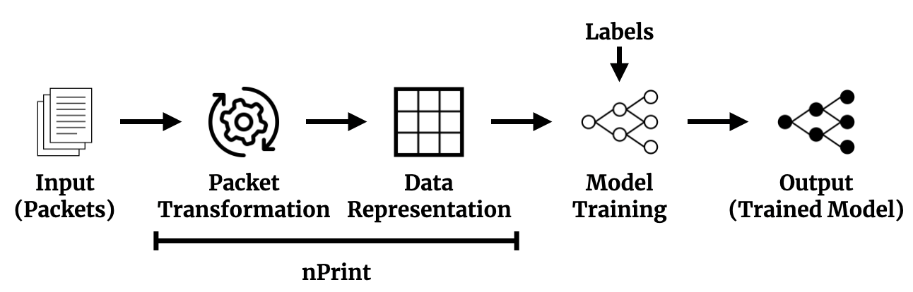

# nPrint: A Standard Data Representation for Network Traffic Analysis

nPrint is a standard data representation for network traffic meant to be directly usable with machine learning algorithms, replacing feature engineering for a wide array of traffic analysis problems. We highly encourage you to read the original nPrint paper, found here: 


## Installation 

### Requirements

* libpcap

### Supported Operating Systems

* Linux
* MacOS (coming soon)

### Install

download the latest release, extract and
```
./configure && make && make install
```

## Implemented Protocols

nPrint currently can parse and transform the following protocols, but is easily extendable.

* IPv4
* IPv6 (Fixed Header)
* TCP
* UDP
* ICMP
* Payloads

## Usage

nPrint can be used in a wide variety of ways. Examples:

* Collect traffic in real time and print IPv4 / TCP nPrints to stdout

```
nprint -4 -t
```

* Collect traffic in real time and print IPv4 / TCP nPrints to file

```
nprint -4 -t -w test.npt 
```

* Use BPF filters to filter traffic before nPrint: ICMP nPrints with incoming traffic filtered for ICMP only.

```
nprint -i -w test.npt -f icmp 
```

* Read from a PCAP and create a nPrint of the first 20 payload bytes for each packet to stdout:

```
nprint -r test.pcap -p 20 
```

* Take a nPrint file and reverse it into a PCAP

```
nprint -r test.npt -z -w test.pcap
```

* Include a relative timestamp for each packet, capturing timeseries information:

```
nprint --relative_timestamps -4 -t 
```

* Read output from a Zmap scan in hex-encoded format:

```
nprint -r zmap_scan.csv -4 -t -u -i -p 50 -w zmap_scan.npt
```

The full list of options are below, and can be found by running: `nprint --help` 

```
  -4, --ipv4                 include ipv4 headers
  -6, --ipv6                 include ipv6 headers
  -f, --filter=STRING        filter for libpcap
      --fields_output        output field values instead of bitstrings
  -i, --icmp                 include icmp headers
  -n, --num_packets=INTEGER  number of packets to parse (if not all)
  -o, --outfile=FILE         file for output, else stdout
  -p, --payload=PAYLOAD_SIZE include n bytes of payload
  -q, --ip_file=FILE         file of IP addresses to filter with, can be
                             combined with num_packets for num_packets per ip
  -r, --read_file=FILE       file to read from, either PCAP or hex packets
      --relative_timestamps  include relative timestamp field
  -t, --tcp                  include tcp headers
  -u, --udp                  include udp headers
  -z, --reverse              reverse nPrint to PCAP
  -?, --help                 Give this help list
      --usage                Give a short usage message
  -V, --version              Print program version
```

# nPrint Machine Learning Pipeline



# nPrint structure

nPrints are well-formatted CSV files meant to be used seamlessly in machine learning pipelines, replacing more tedious feature engineering. The first column of each line in a .npt file will **alwalys** be the source IP address for the given packet. Example nprint of the command `nprint -u -p 2 -f udp -c 5`:

```
ip,udp_sport_0,udp_sport_1,udp_sport_2,udp_sport_3,udp_sport_4,udp_sport_5,udp_sport_6,udp_sport_7,udp_sport_8,udp_sport_9,udp_sport_10,udp_sport_11,udp_sport_12,udp_sport_13,udp_sport_14,udp_sport_15,udp_dport_0,udp_dport_1,udp_dport_2,udp_dport_3,udp_dport_4,udp_dport_5,udp_dport_6,udp_dport_7,udp_dport_8,udp_dport_9,udp_dport_10,udp_dport_11,udp_dport_12,udp_dport_13,udp_dport_14,udp_dport_15,udp_len_0,udp_len_1,udp_len_2,udp_len_3,udp_len_4,udp_len_5,udp_len_6,udp_len_7,udp_len_8,udp_len_9,udp_len_10,udp_len_11,udp_len_12,udp_len_13,udp_len_14,udp_len_15,udp_cksum_0,udp_cksum_1,udp_cksum_2,udp_cksum_3,udp_cksum_4,udp_cksum_5,udp_cksum_6,udp_cksum_7,udp_cksum_8,udp_cksum_9,udp_cksum_10,udp_cksum_11,udp_cksum_12,udp_cksum_13,udp_cksum_14,udp_cksum_15,payload_0,payload_1,payload_2,payload_3,payload_4,payload_5,payload_6,payload_7,payload_8,payload_9,payload_10,payload_11,payload_12,payload_13,payload_14,payload_15
5.6.7.8,1,1,0,1,0,1,1,0,1,0,0,0,0,0,1,1,1,1,0,1,0,1,1,0,1,0,0,0,0,0,1,1,0,0,0,0,0,0,0,1,0,0,0,0,1,1,1,1,1,0,0,0,1,1,1,0,0,0,0,0,1,0,0,1,0,0,0,0,0,0,0,0,0,1,0,0,0,1,0,0
4.3.2.1,1,1,1,1,1,0,0,0,1,0,1,1,1,1,1,0,1,1,0,1,0,1,1,0,1,0,0,0,0,0,1,1,0,0,0,0,0,0,0,1,0,0,0,0,1,1,1,1,0,0,1,0,1,0,1,1,1,0,1,0,0,0,0,1,0,0,0,0,0,0,0,0,0,1,0,0,1,0,0,0
1.2.3.4,1,1,1,0,0,0,0,1,0,0,0,1,0,1,0,1,1,1,1,0,0,0,0,1,0,0,0,1,0,1,0,1,0,0,0,0,0,0,0,0,0,0,1,1,0,1,0,0,1,0,0,1,1,0,0,1,0,1,0,1,0,1,0,0,0,1,0,1,0,0,1,1,0,1,1,1,0,0,0,0
4.3.2.1,1,1,0,1,0,1,1,0,1,0,0,0,0,0,1,1,1,1,0,1,0,1,1,0,1,0,0,0,0,0,1,1,0,0,0,0,0,0,0,1,0,0,0,0,1,1,1,1,0,0,0,1,0,1,0,0,0,1,1,0,1,0,0,0,0,0,0,0,0,0,0,0,0,1,0,0,0,1,0,0
1.2.3.4,1,1,1,1,1,0,0,0,1,0,1,1,1,1,1,0,1,1,0,1,0,1,1,0,1,0,0,0,0,0,1,1,0,0,0,0,0,0,0,1,0,0,0,0,1,1,1,1,0,1,1,1,0,1,0,1,0,0,1,1,0,1,1,1,0,0,0,0,0,0,0,0,0,1,0,0,1,0,0,0
```
# nPrint aggregation

In many cases, we want to match a **set** of packets with a label for classification, for instance, all the packets from a source IP address. nPrint and Pandas make this incredibly easy. Here is some python code to match nPrints with labels, which can be directly fed into machine learning pipelines such as Keras or sklearn

```python
import pandas as pd

labels = { '1.2.3.4' : 'cat_video_traffic', '2.3.4.5' : 'dog_video_traffic', '3.4.5.6' : 'giraffe_video_traffic' }

ml_tups = []
nprint_df = pd.read_csv('test.npt', index_col=0)
# group by source ip address
ip_groups = df.groupby(df.index)
for ip, df in ip_groups:
  ml_tups.append((df, labels[ip]))
```

We can also easily split the traffic into *n* packet samples with the same basic structure:

```python
import pandas as pd

labels = { '1.2.3.4' : 'cat_video_traffic', '2.3.4.5' : 'dog_video_traffic', '3.4.5.6' : 'giraffe_video_traffic' }

ml_tups = []
nprint_df = pd.read_csv('test.npt', index_col=0)
# group by source ip address
ip_groups = df.groupby(df.index)
for ip, group in ip_groups:
   # group in 10 packet samples from the same source IP address
   for _, df in group.groupby(np.arange(len(group)) // 10):
        # Watch out for case where division doesn't split evenly!
        if df.shape[0] != 10:
            continue  
        ml_tups.append((df, labels[ip]))
```
